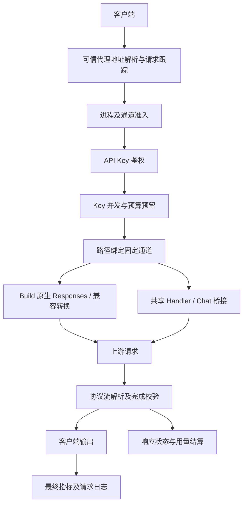

# API-Console 架构与运行链路

## 1. 系统边界

API-Console 是 Go 服务与内嵌管理网页组成的多通道网关。Redis 是账号、模型、配置、Key、响应状态及运维数据的主要存储；凭据主密钥在文件或环境变量中，不保存在 Redis。

当前支持 WorkBuddy、Qoder、Cline 和 Grok Build OAuth。Grok 的 Messages / Chat 是面向客户端的兼容转换，生成上游仍为 Build Responses；不能描述为独立的原生 Anthropic 上游。

## 2. 模块职责

| 位置 | 职责 |
|---|---|
| `cmd/server/main.go` | 配置、密钥、Redis、日志、处理器、后台任务与 HTTP 服务装配 |
| `cmd/server/routes.go` | 推理、模型、管理、静态、健康和调试路由注册 |
| `internal/channel` | 四通道定义、前缀、默认通道和浏览器注册表来源 |
| `internal/middleware` | 鉴权、并发、预算、可信代理、请求跟踪、审计与流刷新 |
| `internal/handler` | WorkBuddy / Qoder / Cline 共用推理编排 |
| `internal/provider` | 共用通道的客户端工厂与能力接口 |
| `internal/workbuddy`、`qoder`、`cline` | 各自授权、目录、请求构造和流解析 |
| `internal/grok` | Build OAuth、原生 Responses、Chat / Messages 转换及会话状态 |
| `internal/chatwire` | Chat 请求、内容块、工具声明与宽松标量解析 |
| `internal/responses` | Responses 类型、SSE、标准工具校验、资源、压缩与桥接输出 |
| `internal/httpclient` / `httpserver` | HTTP 传输、正文限制、超时、错误与流写出 |
| `internal/loadbalancer` | 加权选择、账号快照和并发租约 |
| `internal/accountpolicy` | 错误判定、冷却、重试、切号与重新授权策略 |
| `internal/store` | Redis、领域合并、凭据加密、Key 账本及响应记录 |
| `internal/modelrefresh` | 上游目录发现、刷新租约和模型对账 |
| `internal/refresh` | 账号凭据、目录、套餐及额度观察调度 |
| `internal/opsagg`、`audit`、`alerting` | 分钟聚合、审计采集及告警评估 |
| `internal/selfupdate` | 发行发现、下载验证、替换和独立回退守护 |
| `web` / `internal/template` | 内嵌静态资源、模板、主题及页面交互 |

## 3. 启动与配置链

1. 读取 `-config` 指定文件，未指定时寻找 config.json / config.yaml / config.yml。
2. 应用默认值和代码固定值，加载或创建凭据加密密钥。
3. 使用文件中的 Redis 连接配置初始化存储，只读验证账号凭据可解密性；不自动迁移旧凭据。
4. 读取 Redis 已保存配置，发布有效配置快照；解析失败保留文件配置并记录警告。
5. 装配会话、Key、账号调度、诊断、指标及处理器；注册路由。
6. 启动刷新与告警后台任务，监听配置端口。

密钥在读取 Redis 配置覆盖前确定，因此不能假定修改 Redis 中的密钥路径即可让正在运行的服务更换密钥。配置快照深拷贝并在持久化成功后发布，避免并发请求观察到被原地修改的对象。

## 4. 推理请求链

准入位于昂贵 Redis 鉴权和预算操作之前。Key 并发通过后才预留费用，避免已被拒绝的请求占用预算。同一请求经过重复包装时复用上下文身份，避免重复扣 RPM 或并发槽。

推理路径必须以通道开头，带或不带 /v1 使用相同账号池及处理器；统一入口与模型分发器已删除。资源 GET / DELETE 由路径选择处理器，并验证已存所有权；cancel 与 input_items 显式注册共享处理器。

## 5. 账号选择与重试

账号选择结合通道、启用状态、凭据、模型权益、冷却和并发。负载按连接数与权重衡量，同分优先未使用或较久空闲账号。已知通道账号默认并发为 10，显式账号设置可覆盖。

模型拒绝不应把整个账号当作失效；队列闸门不应引发无意义切号；内容拒绝不应损害账号；只有确定的 OAuth 永久拒绝需要重新授权。Grok 模型冷却、团队节奏、出口健康分别维护，普通 403 不足以证明封号。

共享 Handler 一旦交付输出就不重新生成。Grok 质量暂存只在尚未交付、请求可安全重放且预算允许时重试。有副作用工具请求受到额外保护。

当前重复用户内容允许透传，Grok 文本与推理重复增量也不再按计数终止。真实超时、stop、协议失败及质量策略仍然存在。

## 6. 模型发现与能力

| 通道 | 目录来源 | 重要边界 |
|---|---|---|
| WorkBuddy | `/v3/config` | 免费权益需结合账号已观察目录 |
| Qoder | `/algo/api/v2/model/list` | 公共模型名称与私有 key 映射来自账号快照 |
| Cline | `/ai/cline/recommended-models` | 当前目录发布免费推荐列表，不等同全部套餐模型 |
| Grok Build | `/v1/models` | 目录刷新不是生成探针；过滤不支持的媒体标识 |

失败保留旧快照，不以静态目录冒充上游观察。部分账号失败时禁止破坏性负向裁剪；模型状态、是否可见、账号是否能实际生成是不同事实。

## 7. 数据与并发一致性

- 账号局部修改按领域合并；总用量由原子计数器写入，陈旧账号快照不能覆盖统计。
- 凭据轮换检查预期 refresh token，避免并发轮换写回旧凭据。
- Redis Lua 提供 Key 限流、费用预留结算及目录原子操作。
- 响应所有权绑定 Key 摘要；续接需要匹配所有者，不能仅知道 response ID 就访问。
- 账号事件总线、刷新租约 Hub 和部分客户端缓存仅进程内，不提供跨主机通知。
- Redis 并发租约可共享账号与 Key 配额；进程总准入、显式通道准入仍是本进程状态。

## 8. 前端与可观测性

页面由 Go 模板和原生 JavaScript 实现。静态内容嵌入二进制，资源摘要作为版本参数；没有 Vue / Vite / npm 构建链。前后端通道注册表由 Go 定义生成，并由 CI 检查一致性。

请求最终结果和上游尝试分别记录。采集失败不会把请求本身改成成功，也不应被页面解释为零流量。监控的采样、窗口、健康及告警边界见 [运维监控](operations.md)。

## 9. 修改入口

新增通道不仅需要改目录：还需授权、客户端、能力、错误策略、模型发现、路由、前端注册表和测试。共享线格式修改应落在 chatwire / responses，HTTP 通用逻辑放在 httpclient / httpserver，避免继续扩展 Grok 兼容包装。

旧命名迁移涉及模块导入、release 的 ldflags、在线升级产物匹配、服务路径及数据加密域。改展示名不自动授权数据迁移。详见 [部署手册](deployment.md)。
